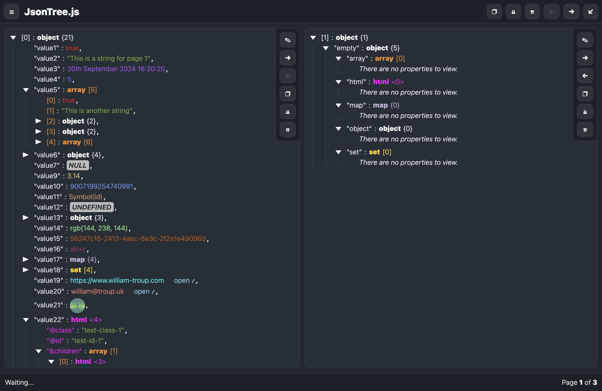

<h1 align="center">
JsonTree.js

[](https://twitter.com/intent/tweet?text=JsonTree.js%2C%20a%20free%20JavaScript%json%20treeview&url=https://github.com/williamtroup/JsonTree.js&hashtags=javascript,treeview,json)
[](https://www.npmjs.com/package/jjsontree.js)
[](https://www.nuget.org/packages/jJsonTree.js/)
[](https://github.com/williamtroup/JsonTree.js/blob/main/LICENSE.txt)
[](https://github.com/williamtroup/JsonTree.js/discussions)
[](https://william-troup.com/)
</h1>

> <p align="center">🔗 A lightweight JavaScript library that generates customizable tree views to better visualize, and edit, JSON data.</p>
> <p align="center">v4.0.0</p>
<br />


<br>
<br>

<h1>What features does JsonTree.js have?</h1>

- 😏 Zero-dependencies and extremely lightweight!
- 🦾 100% TypeScript, allowing greater support for React, Angular, and other libraries!
- 💻 Full API available via public functions.
- 🎏 52 language translations available!
- 📱 Fully styled in CSS/SASS, fully responsive, and compatible with the Bootstrap library!
- 🌈 Full CSS theme support (using :root variables), with dark and light themes.
- 🔍 22 types supported by default (such as Object, Array, primitive types, and even Sets, Maps, and HTML DOM elements).
- 🔣 Support to show the data types, array/object sizes, comas, and opening/closing symbols!
- ☑️ Fully configurable per DOM element!
- 📂 Close and open all objects, arrays, sets, and maps.
- 🚀 Clickable values via custom triggers!
- ⭐ Custom value rendering.
- 📃 Array paging, with configurable column count support (show array objects on different pages)!
- 💧 Drag & Drop JSON files support!
- 📋 Copy to clipboard (all JSON, or just the current page).
- ✏️ Full editing support (double click a value, property, index, or anywhere for everything).
- 🔠 Keyboard navigation keys support!
- 🎥 Toggle between regular and full-screen views.
- ❓ Assign tooltips to any JSON value!
- 💁 Show value/key memory sizes, page numbers, and status updates in the footer!
<br />
<br />


<h1>Where can I view the examples?</h1>

You can view all the examples [here](https://www.william-troup.com/jsontree-js/examples/index.html).
<br>
<br>


<h1>Where can I find the documentation?</h1>

All the documentation can be found [here](https://www.william-troup.com/jsontree-js/documentation/index.html).
<br>
<br>


<h1>What browsers are supported?</h1>

All modern browsers (such as Google Chrome, FireFox, and Opera) are fully supported.
<br>
<br>


<h1>What types are supported?</h1>

- `boolean` Booleans
- `number` Numbers
- `bigint` Big Integers
- `string` Strings
- `object` Objects
- `array` Arrays
- `date` Dates
- `float` Floats
- `null` Nulls
- `symbol` Symbols
- `function` Functions
- `lambda` Lambdas
- `undefined` Undefined
- `color` Colors
- `guid` GUIDs
- `regexp` RegExps
- `map` Maps
- `set` Sets
- `url` URLs
- `image` Images
- `email` Emails
- `html` HTML
- `any` Unknown
<br>
<br>


<h1>What languages are supported?</h1>

- `af` Afrikaans
- `ar` Arabic
- `hy` Armenian
- `be` Belarusian
- `bn` Bengali
- `bg` Bulgarian
- `ca` Catalan
- `zh` Chinese (simplified)
- `da` Danish
- `nl` Dutch
- `en` English (default)
- `eo` Esperanto
- `et` Estonian
- `fa` Farsi
- `fi` Finnish
- `fr` French
- `fy` Frisian
- `gl` Galician
- `ka` Georgian
- `de` German
- `el` Greek
- `he` Hebrew
- `hi` Hindi
- `hu` Hungarian
- `is` Icelandic
- `id` Indonesian
- `ga` Irish
- `it` Italian
- `ja` Japanese
- `ko` Korean
- `lv` Latvian
- `lt` Lithuanian
- `lb` Luxembourgish
- `ms` Malay
- `ne` Nepali
- `no` Norwegian
- `pl` Polish
- `pt` Portuguese
- `ro` Romanian
- `si` Sinhalese
- `sk` Slovak
- `sl` Slovenian
- `es` Spanish
- `sv` Swedish
- `tl` Tagalog
- `ta` Tamil
- `zh-tw` Taiwanese
- `te` Telugu
- `th` Thai
- `tr` Turkish
- `uk` Ukrainian
- `vi` Vietnamese
<br>
<br>


<h1>What are the most recent changes?</h1>

To see a list of all the most recent changes, click [here](https://www.william-troup.com/jsontree-js/documentation/recent-changes.html).
<br>
<br>


<h1>How do I install JsonTree.js?</h1>

You can install the library with npm into your local modules directory using the following command:

```markdown
npm install jjsontree.js
```

Or, you can download the latest zipped up version [here](https://www.william-troup.com/jsontree-js/download.html).

Or, you can also use the following CDN links:

```markdown
https://cdn.jsdelivr.net/gh/williamtroup/JsonTree.js@4.0.0/dist/jsontree.min.js
https://cdn.jsdelivr.net/gh/williamtroup/JsonTree.js@4.0.0/dist/jsontree.js.min.css
```
<br>
<br>


<h1>How do I get started?</h1>

To get started using JsonTree.js, do the following steps:
<br>
<br>

### 1. Prerequisites:

Make sure you include the "DOCTYPE html" tag at the top of your HTML, as follows:

```markdown
<!DOCTYPE html>
```
<br>


### 2. Include Files:

```markdown
<link rel="stylesheet" href="dist/jsontree.js.css">
<script src="dist/jsontree.js"></script>
```
<br>


### 3. DOM Element Binding:

```markdown
<div id="tree-1" data-jsontree-js="{ 'showObjectSizes': true, 'data': [ true, false, 5, 10, 'A String' ] }">
    Your HTML.
</div>
```

To see a list of all the available binding options you can use for "data-jsontree-js", click [here](https://www.william-troup.com/jsontree-js/documentation/binding-options.html).

To see a list of all the available custom triggers you can use for "data-jsontree-js", click [here](https://www.william-troup.com/jsontree-js/documentation/binding-options-custom-triggers.html).

<br>


### 4. Finishing Up:

That's it! Nice and simple. Please refer to the code if you need more help (fully documented).
<br>
<br>

<h1>How do I go about customizing JsonTree.js?</h1>

To customize, and get more out of JsonTree.js, please read through the following documentation.
<br>
<br>


### 1. Public Functions:

To see a list of all the public functions available, click [here](https://www.william-troup.com/jsontree-js/documentation/public-functions.html).
<br>
<br>


### 2. Configuration:

Configuration options allow you to customize how JsonTree.js will function.  You can set them as follows:

```markdown
<script> 
  $jsontree.setConfiguration( {
      safeMode: false
  } );
</script>
```

To see a list of all the available configuration options you can use, click [here](https://www.william-troup.com/jsontree-js/documentation/options.html).